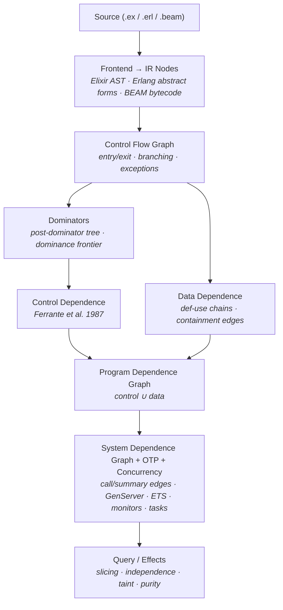

# Reach

Program dependence graph for Elixir and Erlang.

Reach builds a graph that captures **what depends on what** in your code.
Given any expression, you can ask: what affects it? What does it affect?
Can these two statements be safely reordered? Does user input reach this
database call without sanitization?


## Use cases

### Security: taint analysis

Does user input reach a dangerous sink without sanitization?

```elixir
graph = Reach.file_to_graph!("lib/my_app_web/controllers/user_controller.ex")

Reach.taint_analysis(graph,
  sources: [type: :call, function: :params],
  sinks: [type: :call, module: System, function: :cmd, arity: 2],
  sanitizers: [type: :call, function: :sanitize]
)
#=> [%{source: ..., sink: ..., path: [...], sanitized: false}]
```

### Code quality: dead code detection

```elixir
graph = Reach.file_to_graph!("lib/accounts.ex")

for node <- Reach.dead_code(graph) do
  IO.warn("Dead code at #{inspect(node.source_span)}: #{node.type}")
end
```

### Refactoring: safe reordering

```elixir
graph = Reach.file_to_graph!("lib/pipeline.ex")

for block <- Reach.nodes(graph, type: :block),
    {a, b} <- pairs(block.children) do
  if Reach.independent?(graph, a.id, b.id) do
    IO.puts("Statements at lines #{a.source_span.start_line} and " <>
      "#{b.source_span.start_line} can be safely reordered")
  end
end
```

### Clone detection: reordering-equivalent code

Two blocks with the same statements in different order are clones if
the statements are independent. `canonical_order` sorts independent
siblings by structural hash so both orderings produce the same sequence:

```elixir
# For ExDNA integration
order = Reach.canonical_order(graph, block_node_id)
hash = :erlang.phash2(Enum.map(order, fn {_, node} -> node end))
```

### OTP: GenServer state flow analysis

```elixir
graph = Reach.file_to_graph!("lib/my_server.ex")
edges = Reach.edges(graph)

# Which callbacks read state?
state_reads = Enum.filter(edges, &(&1.label == :state_read))

# Does state flow between callbacks?
state_passes = Enum.filter(edges, &(&1.label == :state_pass))

# ETS write-then-read dependencies
ets_deps = Enum.filter(edges, &match?({:ets_dep, _table}, &1.label))
```

### Concurrency: crash propagation

```elixir
graph = Reach.file_to_graph!("lib/my_supervisor.ex")
edges = Reach.edges(graph)

# Which monitors connect to which :DOWN handlers?
Enum.filter(edges, &(&1.label == :monitor_down))

# Does this process trap exits? Which handler receives them?
Enum.filter(edges, &(&1.label == :trap_exit))

# Task.async → Task.await data flow
Enum.filter(edges, &(&1.label == :task_result))

# Supervisor child startup ordering
Enum.filter(edges, &(&1.label == :startup_order))
```

## Installation

```elixir
def deps do
  [{:reach, "~> 1.0"}]
end
```

## Building a graph

```elixir
# From Elixir source
{:ok, graph} = Reach.string_to_graph("def foo(x), do: x + 1")
{:ok, graph} = Reach.file_to_graph("lib/my_module.ex")

# From Erlang source
{:ok, graph} = Reach.string_to_graph(source, language: :erlang)
{:ok, graph} = Reach.file_to_graph("src/my_module.erl")  # auto-detected

# From pre-parsed AST (for Credo/ExDNA integration)
{:ok, ast} = Code.string_to_quoted(source)
{:ok, graph} = Reach.ast_to_graph(ast)

# From compiled BEAM bytecode (sees macro-expanded code)
{:ok, graph} = Reach.module_to_graph(MyApp.Accounts)
{:ok, graph} = Reach.compiled_to_graph(source)

# Bang variants
graph = Reach.file_to_graph!("lib/my_module.ex")
```

The BEAM frontend captures code invisible to source-level analysis —
`use GenServer` callbacks, macro-expanded `try/rescue`, generated functions:

```elixir
# Source: only sees init/1 and handle_call/3
Reach.string_to_graph(genserver_source)

# BEAM: also sees child_spec/1, terminate/2, handle_info/2
Reach.compiled_to_graph(genserver_source)
```

## Multi-file project analysis

```elixir
# Analyze a whole Mix project
project = Reach.Project.from_mix_project()

# Or specific paths
project = Reach.Project.from_glob("lib/**/*.ex")

# Cross-module taint analysis
Reach.Project.taint_analysis(project,
  sources: [type: :call, function: :params],
  sinks: [type: :call, module: System, function: :cmd]
)

# Dependency summaries for external modules
summaries = Reach.Project.summarize_dependency(Ecto.Adapters.SQL)
project = Reach.Project.from_mix_project(summaries: summaries)
```

## API reference

### Nodes

```elixir
Reach.nodes(graph)                                    # all nodes
Reach.nodes(graph, type: :call)                       # by type
Reach.nodes(graph, type: :call, module: Enum)         # by module
Reach.nodes(graph, type: :call, module: Repo, function: :insert, arity: 1)

node = Reach.node(graph, node_id)
node.type        #=> :call
node.meta        #=> %{module: Repo, function: :insert, arity: 1}
node.source_span #=> %{file: "lib/accounts.ex", start_line: 12, ...}
```

### Slicing

```elixir
Reach.backward_slice(graph, node_id)   # what affects this?
Reach.forward_slice(graph, node_id)    # what does this affect?
Reach.chop(graph, source_id, sink_id)  # how does A influence B?
```

### Data flow and independence

```elixir
Reach.data_flows?(graph, source_id, sink_id)
Reach.depends?(graph, id_a, id_b)
Reach.independent?(graph, id_a, id_b)
Reach.has_dependents?(graph, node_id)
Reach.passes_through?(graph, source_id, sink_id, &predicate/1)
```

### Effects

```elixir
Reach.pure?(node)              #=> true
Reach.classify_effect(node)    #=> :pure | :io | :read | :write | :send | :receive | :exception | :unknown
```

Covers `Enum`, `Map`, `List`, `String`, `Keyword`, `Tuple`, `Integer`,
`Float`, `Atom`, `MapSet`, `Range`, `Regex`, `URI`, `Path`, `Base`, and
Erlang equivalents. `Enum.each` correctly classified as impure.

### Dependencies

```elixir
Reach.control_deps(graph, node_id)   #=> [{controller_id, label}, ...]
Reach.data_deps(graph, node_id)      #=> [{source_id, :variable_name}, ...]
Reach.edges(graph)                   # all dependence edges
```

### Interprocedural

```elixir
Reach.function_graph(graph, {MyModule, :my_function, 2})
Reach.context_sensitive_slice(graph, node_id)   # Horwitz-Reps-Binkley
Reach.call_graph(graph)                         # {module, function, arity} vertices
```

### Taint analysis

```elixir
# Keyword filters (same format as nodes/2)
Reach.taint_analysis(graph,
  sources: [type: :call, function: :params],
  sinks: [type: :call, module: Repo, function: :query],
  sanitizers: [type: :call, function: :sanitize]
)

# Predicates also work
Reach.taint_analysis(graph,
  sources: &(&1.meta[:function] in [:params, :body_params]),
  sinks: [type: :call, module: System, function: :cmd]
)
#=> [%{source: node, sink: node, path: [node_id, ...], sanitized: boolean}]
```

### Dead code

```elixir
Reach.dead_code(graph)
#=> [%Reach.IR.Node{type: :call, meta: %{function: :upcase}}, ...]
```

### Canonical ordering

```elixir
Reach.canonical_order(graph, block_id)
#=> [{node_id, %Reach.IR.Node{}}, ...] sorted so independent
#   siblings have deterministic order regardless of source order
```

### Neighbors

```elixir
Reach.neighbors(graph, node_id)                # all direct neighbors
Reach.neighbors(graph, node_id, :state_read)   # only state_read edges
Reach.neighbors(graph, node_id, :data)         # matches {:data, _} labels
```

### Raw graph access

```elixir
raw = Reach.to_graph(graph)     # returns the underlying libgraph Graph.t()
Graph.vertices(raw)             # use any libgraph function
Graph.get_shortest_path(raw, id_a, id_b)
```

### Export

```elixir
{:ok, dot} = Reach.to_dot(graph)
File.write!("graph.dot", dot)
# dot -Tpng graph.dot -o graph.png
```

## Edge types

| Label | Source | Meaning |
|-------|--------|---------|
| `{:data, var}` | DDG | Data flows through variable `var` |
| `:containment` | DDG | Parent expression depends on child sub-expression |
| `{:control, label}` | CDG | Execution controlled by branch condition |
| `:call` | SDG | Call site to callee function |
| `:parameter_in` | SDG | Argument flows to formal parameter |
| `:parameter_out` | SDG | Return value flows back to caller |
| `:summary` | SDG | Shortcut: parameter flows to return value |
| `:state_read` | OTP | GenServer callback reads state parameter |
| `:state_pass` | OTP | State flows between consecutive callbacks |
| `{:ets_dep, table}` | OTP | ETS write → read on same table |
| `{:pdict_dep, key}` | OTP | Process dictionary put → get on same key |
| `:message_order` | OTP | Sequential sends to same pid |
| `:monitor_down` | Concurrency | `Process.monitor` → `handle_info({:DOWN, ...})` |
| `:trap_exit` | Concurrency | `Process.flag(:trap_exit)` → `handle_info({:EXIT, ...})` |
| `:link_exit` | Concurrency | `spawn_link` / `Process.link` → `:EXIT` handler |
| `:task_result` | Concurrency | `Task.async` → `Task.await` data flow |
| `:startup_order` | Concurrency | Supervisor child A starts before child B |
| `{:message_content, tag}` | OTP | `send(pid, {tag, data})` payload → handler pattern vars |
| `:call_reply` | OTP | `{:reply, value, state}` → `GenServer.call` return |
| `:match_binding` | DDG | Match RHS flows to LHS definition var |
| `:higher_order` | SDG | Argument flows through higher-order function to result |

## Architecture



## Performance

Benchmarked on real projects (single-threaded, Apple M1 Pro):

| Project | Files | Functions | IR Nodes | Time | ms/file |
|---------|-------|-----------|----------|------|---------|
| ex_slop | 26 | 109 | 5,186 | 36ms | 1.4 |
| ex_dna | 32 | 208 | 10,649 | 87ms | 2.7 |
| Livebook | 72 | 589 | 22,156 | 160ms | 2.2 |
| Oban | 64 | 606 | 31,413 | 195ms | 3.0 |
| Keila | 190 | 1,074 | 49,354 | 282ms | 1.5 |
| Phoenix | 74 | 1,090 | 48,292 | 333ms | 4.5 |
| Absinthe | 282 | 1,411 | 68,416 | 375ms | 1.3 |

740 files, zero crashes.

## References

- Ferrante, Ottenstein, Warren — *The Program Dependence Graph and Its Use in
  Optimization* (1987)
- Horwitz, Reps, Binkley — *Interprocedural Slicing Using Dependence Graphs*
  (1990)
- Silva, Tamarit, Tomás — *System Dependence Graphs for Erlang Programs* (2012)
- Cooper, Harvey, Kennedy — *A Simple, Fast Dominance Algorithm* (2001)

## License

[MIT](LICENSE)
